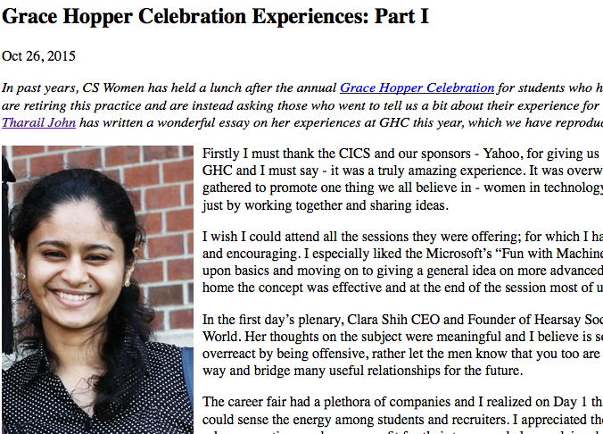
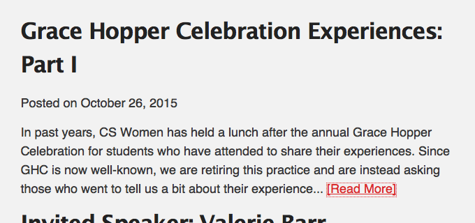

# CS Women Blog Posts

In moving to hosting our [group's webpage on GitHub](http://cswomenumass.github.io), we have also begun hosting our blog on GitHub. This repository is a submodule of the [website repository](http://github.com/CSWomenUMass/cswomenumass.github.io).

# Writing and Submitting a Blog Post

* Fork this repository.
* Add this repository as a remote, called `upstream`:
  * `git remote add upstream git@github.com:CSWomenUMass/blog-posts.git`
  * Your fork of this repository will be current when you first fork it, but if you decide to write a second blog post (and please do!), you will need to make sure it is updated. Recall that you pull changes from your own remote repository (i.e., the fork) into your local folder with `git pull origin master`. You can now pull changes from this repository into your local version with `git pull upstream master`. 
* Write the blog post in Markdown.
  - Make sure you have included the Markdown front matter:
  ```
  layout: post
  title: "<post_title>"
  date: <YYYY>-<MM>-<DD> 00:00:00
  categories: <comma_separated_tag_list>
  ```
  - Name the file like so: `<YYYY>-<MM>-<DD>-<post_title>.md`
  - You can compare with exisiting files in this repository.
* Ensure that everything renders okay:
  * Run `./tests.sh`. This will generate a stripped down version of the website for the purposes of rendering Markdown.
  * Open `http://localhost:4000`. You will just see blog post summaries displayed.
  * Click on your blog post. Note that the css will not be the same -- the css on the main website is is compiled from a scss specification. If you want to see how the page will be rendered in the context of the main website, you will need to check out the [main repository](http://github.com:CSWomenUMass/cswomenumass.github.io) with the `--recursive` option to grab this submodule and port the changes you've made in your local version of website.
* Submit a pull request to the `blog` branch of this repository and include screen shots of the added blog post, e.g.

